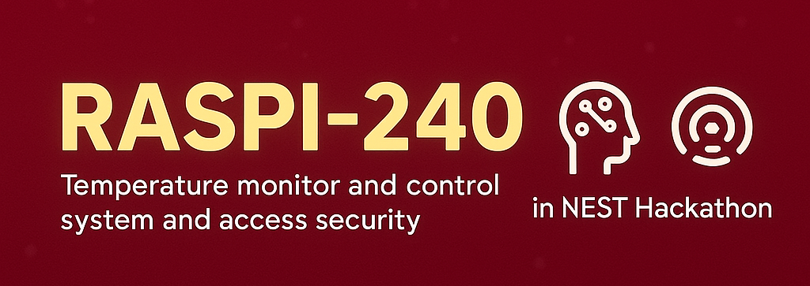

# Smart Industrial Monitoring System
## Team RASPI-240 - NEST Hackathon 2025 Project

)

## 🏆 NEST Hackathon Experience

Our team RASPI-240 had an amazing experience at the NEST Hackathon 2025, where we developed a comprehensive industrial monitoring and security system. This solution combines IoT sensors, machine learning, and web technologies to create a holistic approach to industrial safety and efficiency.

## 📋 Project Overview

Our Smart Industrial Monitoring System provides:

- **Access Control**: RFID badge-based security for restricted areas
- **Temperature Monitoring**: Real-time temperature tracking with alerts
- **Facial Recognition**: AI-powered authentication for administrators
- **Failure Prediction**: Machine learning algorithms for preventive maintenance
- **Dashboard**: Web interface for monitoring and managing all systems

## 🎥 Demo Videos

### 3D System Architecture Visualization
Our system's physical layout and component interconnections in 3D:

### Facial Recognition Security System
AI-powered facial recognition for administrator access:

### Interactive Dashboard & Site Operations
Complete walkthrough of our web dashboard and monitoring system:

## 🧩 System Components

Our solution consists of several interconnected components:

### 1. RFID Access Control
ESP32-based system for controlling access to restricted areas using RFID badges. [Details](./docs/rfid_access.md)

### 2. Temperature Control
Multi-sensor temperature monitoring system with alerting capabilities. [Details](./docs/temperature_control.md)

### 3. MQTT Bridge
Node.js service that connects hardware components to our Supabase database using MQTT protocol. [Details](./docs/mqtt_bridge.md)

### 4. Face Recognition System
AI-powered facial recognition system for administrator authentication. [Details](./docs/face_recognition.md)

### 5. Failure Prediction System
Machine learning models for predicting equipment failures before they occur. [Details](./docs/failure_prediction.md)

### 6. Web Dashboard
React-based web interface that provides real-time monitoring and control of all system components. [Details](./docs/web_dashboard.md)

## 🔌 Hardware Components

Our system utilizes the following hardware components:

### Computing & Control
- **Development PC**: For development, testing and running the face recognition system
- **ESP32 WROOM Model S**: Two units - one for access control system and one for temperature monitoring
- **USB Cables**: For connecting and programming ESP boards

### Access Control
- **RFID Reader Module**: For badge-based authentication
- **RFID Tags/Cards**: For user identification
- **LEDs**: Status indicators for access control
- **Servo Motor**: For physical door/lock control
- **Ultrasonic Sensor**: For presence detection
- **LCD 16x2 Display**: For showing access status and information

### Temperature Monitoring
- **DHT22 Sensor**: For temperature and humidity monitoring
- **LCD 16x2 Display**: For displaying temperature readings
- **2x 24V Fans**: For automated cooling system

### Networking & Connectivity
- **ESP32 Built-in Wi-Fi**: For wireless connectivity to MQTT broker
- **Jumper Wires**: For connecting components
- **Breadboards**: For prototyping circuits

### Power & Enclosure
- **Power Adapters**: Various power supplies for components
- **Project Enclosure**: For housing the electronics
- **Mounting Hardware**: For securing components

## 🚀 Installation & Setup

Please refer to our [Installation Guide](./docs/installation.md) for detailed setup instructions.

## 🔧 Technologies Used

- **Hardware**: PC, ESP32 WROOM Model S, RFID, Sensors
- **Backend**: Node.js, MQTT (HiveMQ), Supabase
- **Frontend**: React, Vite, TailwindCSS
- **ML/AI**: TensorFlow, OpenCV, Custom ML Models
- **DevOps**: GitHub Actions, Vercel

## 👥 Team RASPI-240

- Nassim Benhalldja
- Arabet Abdelhakim
- Derar Mohanned
- Baslimane Daoud Elhakim
- HAMAIDI Mohamed Idris Hamadi

## 📚 Resources

- [HiveMQ Documentation](https://www.hivemq.com/docs/)
- [RandomNerdTutorials RFID Guide](https://randomnerdtutorials.com/)
- [Supabase Documentation](https://supabase.io/docs)

## 📄 License

This project is licensed under the MIT License - see the [LICENSE](LICENSE) file for details.

---

Developed with ❤️ by Team RASPI-240 for the NEST Hackathon 2025
